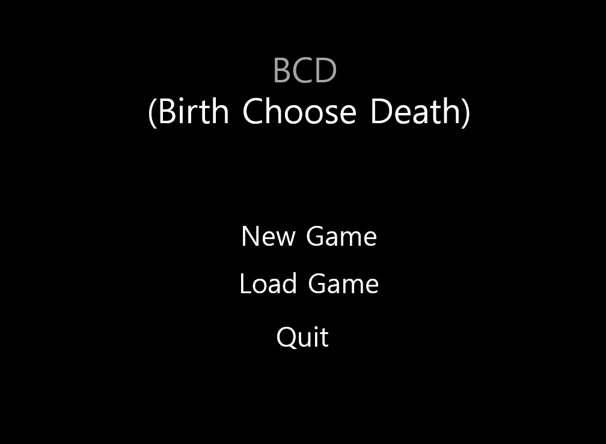
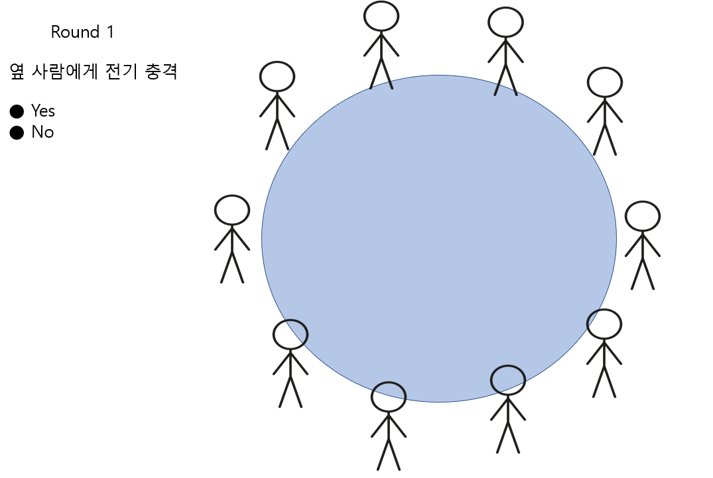

##기획서

### 게임 이름

**BCD** (Birth Choose Death)

"삶과 죽음 사이에는 선택의 연속이다."

**메인 화면**

 

**시작 화면**

 

**게임 장르**

1. 스릴러
2. 롤플레잉
3. 시뮬레이션
4. 전략

선택의 연속.
자신이 선택하는 것에 따라 스토리 진행이 달라진다.

**기획 의도**

1. 돈이 사회에 미치는 영향
2. 이기주의
3. 사람은 정직해야 한다.
4. 마녀사냥의 위험성
5. 인간의 존엄성
6. sns의 위험성
7. 잘못된 정보의 위험성

**스토리**

각 캐릭터들이 주어지고, 각 캐릭터들마다 돈이 없고, 궁핍하고 어려운 상황에 처해 있다.

이 캐릭터들은 돈이 정말 필요하다.

어느 날, sns를 통해 거액의 돈이 걸린 게임을 하자는 제안이 들어온다.

주인공은 고민 끝에 게임 장소로 가게 되는데...

돈이 필요하고, 각자 어려운 상황을 가진 사람들이 다 모인다.

게임의 주최자는 잔인한 선택지를 주며 선택하라고 한다.

주인공을 끝까지 살아남게 하라!
