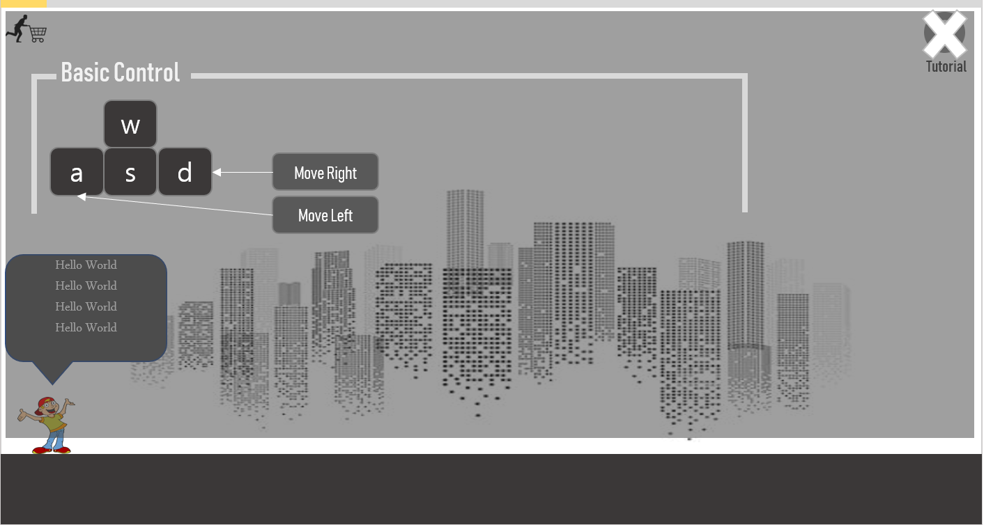
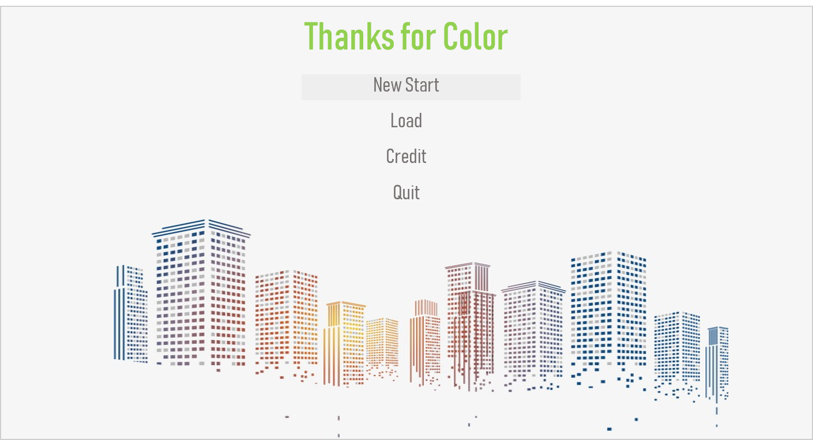

기획서
===

게임 이름
---
Give Me The Color

**메인화면**

**Loading View**

**Tutorials**

**Final**

게임 장르
---

1. 롤플레잉
2. 어드벤쳐
3. 전략 시뮬레이션
4. 시뮬레이션 : 채택!
5. 액션
6. 퍼즐
7. 기타

가벼운 조작!

선택형 게임 but 방향키 , 점프 정도의 조작은 괜찮지 않을까 .. ??

기획 의도
---

모두다 똑같아지려고 하는 현재 사회를 비판

 - 요즘 히어로 물들이 뜨는 이유는 자기가 최고라고 생각하지 않아서가 아닐까?

 - 방향성이 없는 삶이 잘못된 삶인가 ?

 - 왜 다들 공무원이 되려하고 회사원이 되려하는가?
 
 - 한끼에 만원이상 하는 식사 이대로 괜찮은가 ?
 
 - 연예인 마녀사냥 지나치지 않은가 ?
 
 - 어려운 사람을 함부로 믿고 도와주기 힘든 세상이지 않는가?
 
 - 남성과 여성 서로의 차이를 존중하며 잘 지낼수는 없을까 ?
 
 - 완벽한 남녀평등은 무엇인가 ?
 
 - 

스토리
---

주인공 제니는 여성캐릭터이다.

그녀는 색을 가지고 있다.

그리고 자신의 색을 맘에들어한다. 

그러나, 여러분과 그녀가 앞으로 함께할 이 세상에는 색이라곤 온데간데 없고 그저 흑과 백만 있을 뿐이다.

사람들은 흑도, 백도 아닌 그저 회색으로 살아간다.

왜 그렇게 많은 사람들이 회색으로 살아가는지에 대해 아무도 이야기해주지않고 아무도 궁금해하지 않는다.

아마도 색을 누군가에게 빼앗겼을지도 모른다.

그런 세상에서 그녀와 당신은 세상에 색을 불어넣으려고 한다.

색을 불어넣는 방법은 아주 쉽다!

사람들을 진심으로 대하며, 그들을 감동시키는 것 이다.

그러나 이렇게 많은 사람과 넓은 세상에 언제 다 색을 불어넣을 수 있을까..?

그녀를 도와 세상을 색칠하자.

