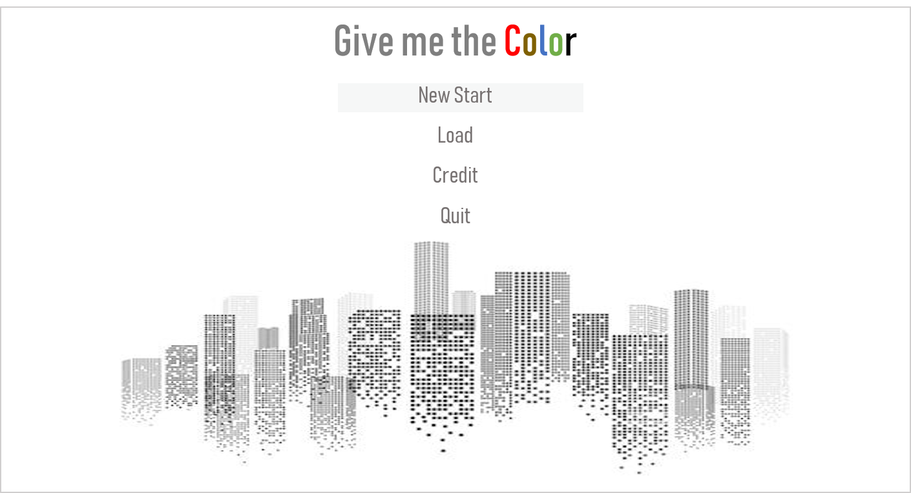

기획서
===

게임 이름
---
Give Me The Color

**메인화면**

**Loading View**

**Tutorials**

**Final**

게임 장르
---

1. 롤플레잉
2. 어드벤쳐
3. 전략 시뮬레이션
4. 시뮬레이션 : 채택!
5. 액션
6. 퍼즐
7. 기타

가벼운 조작!

선택형 게임 but 방향키 , 점프 정도의 조작은 괜찮지 않을까 .. ??

기획 의도
---

모두다 똑같아지려고 하는 현재 사회를 비판

 - 요즘 히어로 물들이 뜨는 이유는 자기가 최고라고 생각하지 않아서가 아닐까?

 - 방향성이 없는 삶이 잘못된 삶인가 ?

 - 왜 다들 공무원이 되려하고 회사원이 되려하는가?
 
 - 한끼에 만원이상 하는 식사 이대로 괜찮은가 ?
 
 - 연예인 마녀사냥 지나치지 않은가 ?
 
 - 어려운 사람을 함부로 믿고 도와주기 힘든 세상이지 않는가?
 
 - 남성과 여성 서로의 차이를 존중하며 잘 지낼수는 없을까 ?
 
 - 완벽한 남녀평등은 무엇인가 ?
 
 - 

스토리
---

주인공 제니는 여성캐릭터이다.

어디서 왔는지 어디로 가야하는지 

